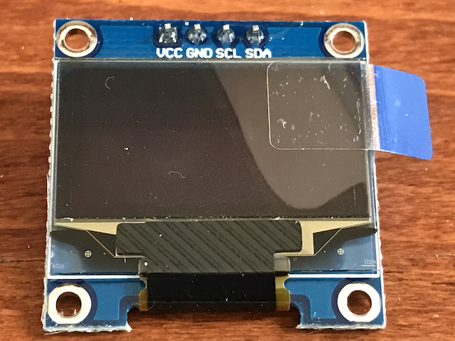
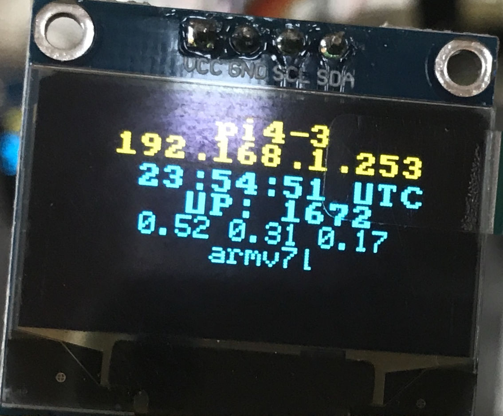
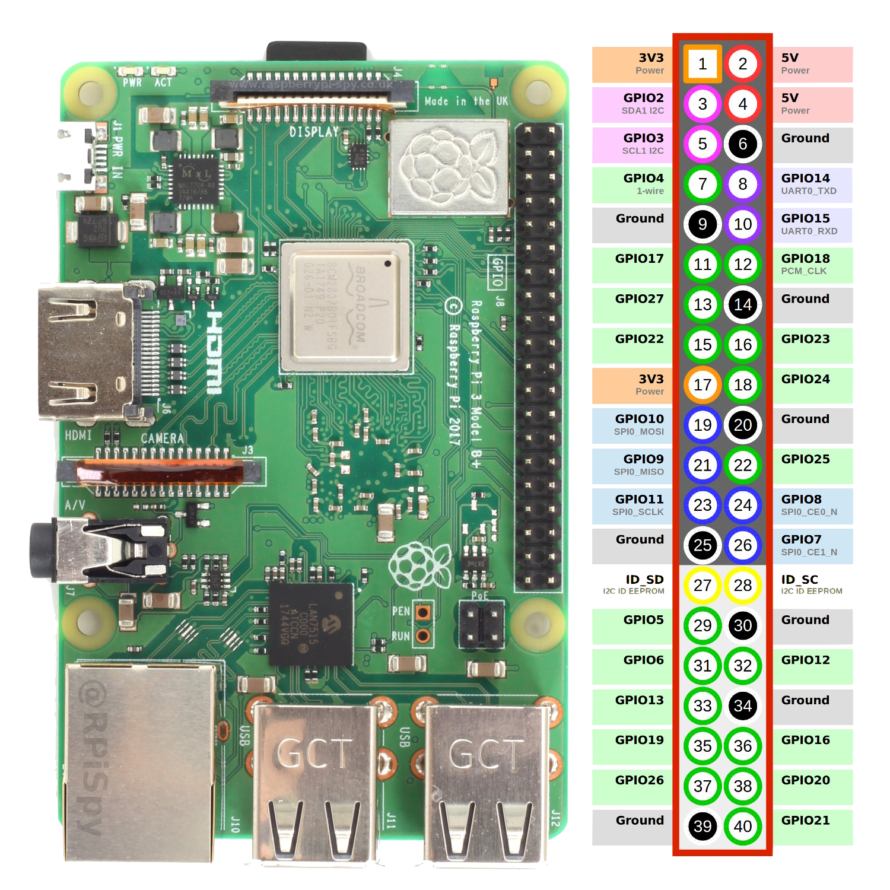

# &#9114; - `oled`
Display information on an OLED serial connected `I2C` device in three text sizes and two colors.

2. Use `raspi-config` to enable `I2C` interface
3. Install `docker` and `git`
4. Clone this repository
5. Change directory and run `make`
6. Connect display using female-to-female GPIO jumper cables

Original written by mosquito@darlingevil.com

## Parts

+ RaspberryPi Model 3/4
+ 128x64 pixel, 0.96", yellow/blue `I2C` [OLED display](https://www.amazon.com/gp/product/B07WPCPM5H/ref=ppx_yo_dt_b_asin_title_o02_s00?ie=UTF8&psc=1)
+ Female-Female `GPIO` [cables](https://www.amazon.com/gp/product/B072L1XMJR/ref=ppx_yo_dt_b_asin_title_o02_s00?ie=UTF8&psc=1)



## Step 1 - Enable `I2C` interface
The serial connection may need to be enabled; use the `raspi-config` command-line program; for example:

```
% sudo raspi-config
```

A terminal-based interface will launch and provide menu options to enable the `I2C` interface; for example:


## Step 2 - Configuration
The indicated display supports up to eight (8) _lines_ of text, in three fonts and two colors.  The first two _lines_ of text are yellow and the last six _lines_ are blue.

+ `SMALL` - 8 lines; 20 characters/line
+ `NORMAL` - 8 lines; 16 characters/line
+ `BIG` - consumes 3 lines; 8 characters

The information displayed is dependent on the configuration options; the default:

+ `display` - one of `default`, `horizon`, `custom`
+ `messages[]` - array of _dict_ for `custom` _display_
 + `font` - font of message
 + `line` - starting line
 + `text` - text to display
 + `align` - alignment, `left`, `center`, `right`; default: `center`

### `default` _display_
This information includes:

+ device _name_
+ TCP/IPv4 address
+ time in UTC
+ uptime in seconds
+ 1, 5, 15, load average
+ architecture (e.g. `armv7l`)



## Step 3 - Connection
The specified display connects to the `GPIO` pins on the RaspberryPi model 3 and 4 using the four (4) pins on the back of the display; these pins are:

+ `VCC` - 3.3V current; _recommended_ `PIN1`
+ `SDA` - serial data; **required** `PIN3`
+ `SCL` - serial clock; **required** `PIN5`
+ `GND` - ground; _recommended_ `PIN9`


### GPIO Reference

